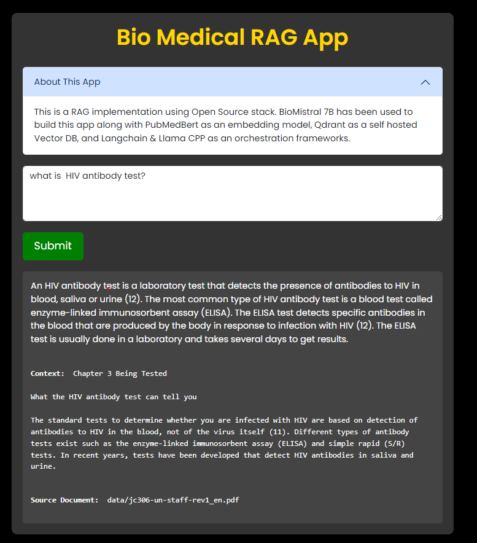

# Medical RAG using BioMistral 7B LLM Running Locally 🏥🩺

This project implements a RAG (Retrieval-Augmented Generation) system using an open-source stack. It utilizes BioMistral 7B as the main model along with other technologies such as PubMedBert for embedding, Qdrant for a self-hosted Vector DB, and Langchain & Llama CPP for orchestration frameworks.

# Bio Mistral

BioMistral refers to a collection of specialized Large Language Models (LLMs) designed specifically for the medical domain. It's built upon the foundation of the Mistral LLM, a powerful language model in its own right, and then further trained on a massive dataset of medical text and scientific publications, particularly from PubMed Central. This extra training allows BioMistral to understand and respond to medical inquiries and tasks with greater accuracy and nuance.

Here are some key points about BioMistral:

* Open-source: All BioMistral models are available under an Apache License, meaning they are free to use and modify for research and development purposes.
* Multiple models: BioMistral offers a suite of models with different sizes and capabilities, catering to diverse needs and hardware limitations.
* High performance: BioMistral consistently ranks among the top open-source medical LLMs in various benchmarks, demonstrating its effectiveness in understanding and generating medical text.
* Applications: BioMistral can be used for various tasks in the medical field, including:
    * Generating medical summaries and reports
    * Answering medical questions in a comprehensive and informative way
    * Assisting with clinical decision-making
    * Analyzing medical literature
    * Developing chatbots for patient education and support

# UI



## Getting Started

To run this project, follow these steps:

1. Install Docker.
2. Pull the Qdrant Docker image:
    ```bash
    docker pull qdrant/qdrant
    ```
3. Run the Qdrant container:
    ```bash
    docker run -p 6333:6333 --rm qdrant/qdrant
    ```
4. Check if the vector DB is working by visiting [http://localhost:6333/dashboard](http://localhost:6333/dashboard).
5. Download BioMistral 7B using [this link](https://huggingface.co/MaziyarPanahi/BioMistral-7B-GGUF/resolve/main/BioMistral-7B.Q4_K_M.gguf?download=true) and place the model file in the main working directory of the project.
6. Install the required libraries using:
    ```python
    pip install -r requirements.txt
    ```
7. Create a vector database of the files in the data folder by running:
    ```python
    python create_vector_db.py
    ```
8. Finally, run the application:
    ```python
    uvicorn app:app --reload
    ```

## Contributing

Pull requests are welcome. For major changes, please open an issue first to discuss what you would like to change.

Please make sure to update tests as appropriate.
